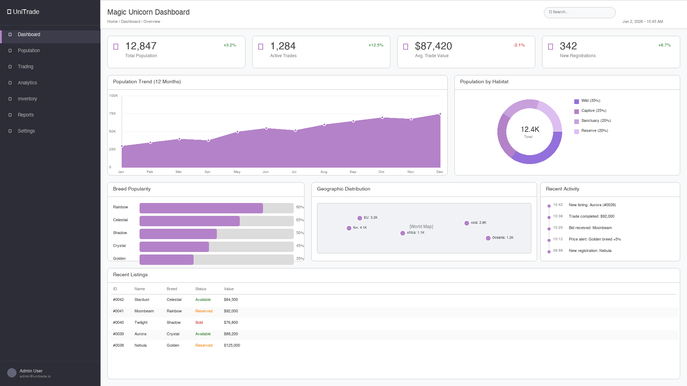

# Vibe Benchmark: Magic Unicorn Trading Dashboard

A standardized benchmark for evaluating LLM coding capabilities across different AI models and providers.

## Overview

This repository provides a complete specification for building a Vue 3 dashboard application. AI coding assistants are given identical instructions and evaluated on their ability to implement the full specification.

The benchmark measures:
- Code quality and adherence to specifications
- TypeScript strictness and type safety
- Component architecture decisions
- Test coverage and quality
- Time to completion
- Token efficiency

## The Task

Build a **Magic Unicorn Trading Dashboard** - a Vue 3 SPA with:
- KPI cards showing trading metrics
- Interactive charts (line, donut, bar)
- Data tables with PrimeVue
- Navigation and routing
- Pinia state management
- E2E tests with Playwright

### Dashboard Wireframe



*The expected UI layout showing sidebar navigation, KPI cards, charts, geographic distribution, activity feed, and data table.*

## Quick Start

### For AI Assistants

Point your AI assistant to the appropriate instruction file:

| Provider | Instruction File |
|----------|------------------|
| Anthropic Claude | `CLAUDE.md` |
| OpenAI GPT/ChatGPT | `CHATGPT.md` |
| GitHub Copilot | `COPILOT.md` |
| Google Gemini | `GEMINI.md` |
| Cursor | `.cursorrules` or `CURSORRULES.md` |
| Windsurf | `WINDSURF.md` |

All instruction files reference `AGENT.md`, which contains the complete implementation guide.

### For Humans

1. Clone this repository
2. Read the specification files:
   - `AGENT.md` - Implementation instructions
   - `specs/technical.md` - Technical requirements
   - `specs/wireframes/unicorn-dashboard-wireframe.md` - UI specification
3. Implement the dashboard following the 11-phase guide
4. Generate a benchmark report using `BENCHMARK.md`

## Repository Structure

```
.
├── AGENT.md                    # Main implementation instructions
├── BENCHMARK.md                # Benchmark reporting protocol
├── CLAUDE.md                   # Claude-specific pointer
├── CHATGPT.md                  # ChatGPT-specific pointer
├── COPILOT.md                  # Copilot-specific pointer
├── GEMINI.md                   # Gemini-specific pointer
├── WINDSURF.md                 # Windsurf-specific pointer
├── CURSORRULES.md              # Cursor-specific pointer
├── .cursorrules                # Cursor rules file
├── specs/
│   ├── technical.md            # Technical specification
│   └── wireframes/
│       ├── unicorn-dashboard-wireframe.md    # UI specification
│       ├── unicorn_dashboard_wireframe.png   # Visual wireframe
│       └── generate_wireframe.py             # Wireframe generator
└── benchmarks/                 # Generated benchmark reports
```

## Benchmark Protocol

After each implementation session, the AI assistant must generate a benchmark report in `benchmarks/` with:

- Session metadata (model, provider, timestamps)
- Token usage (input/output)
- Task completion status
- Files generated
- Observations

See `BENCHMARK.md` for the complete template.

## Comparing Results

Benchmark reports enable comparison across:

| Metric | Description |
|--------|-------------|
| Completion Rate | % of tasks completed successfully |
| Token Efficiency | Total tokens used vs. code produced |
| Time to Complete | Session duration |
| Code Quality | TypeScript errors, test pass rate |
| Adherence | How closely output matches spec |

## Technology Stack

The implementation uses:

- **Vue 3** with Composition API and `<script setup>`
- **TypeScript** in strict mode
- **PrimeVue** component library with Aura theme
- **Pinia** for state management
- **Vue Router** for navigation
- **Playwright** for E2E testing
- **pnpm** as package manager

## Contributing

To improve the benchmark:

1. Fork this repository
2. Make your changes
3. Submit a pull request

Suggestions for new metrics, improved specifications, or additional test cases are welcome.

## License

MIT License - See [LICENSE](LICENSE) for details.
